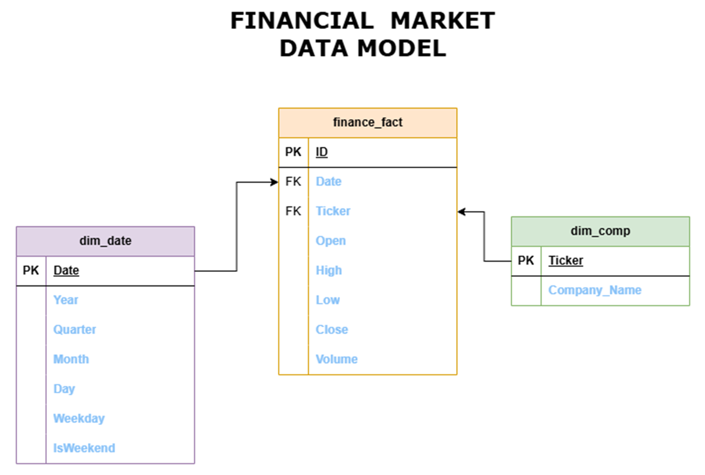
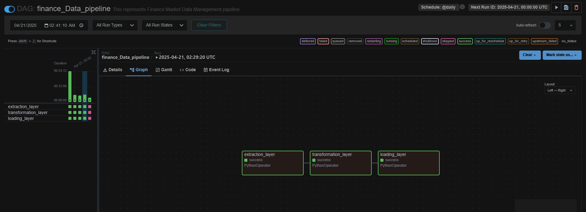
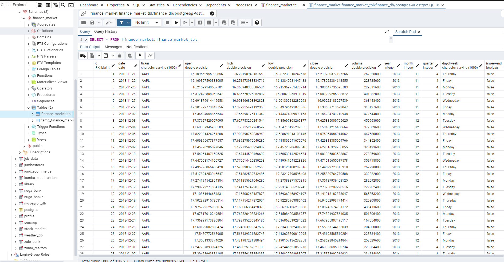

# Financial Market Data Project

## Introduction
#### In today's fast-paced financial markets, timely and accurate data is crucial. However, managing vast amounts of financial data presents significant challenges. The key issues we face include the efficient extraction and processing of real-time and historical data, maintaining high data quality standards. Addressing these challenges is vital for improving our service offerings and maintaining client trust.

## AIM
#### 1. Develop a pipeline to analyze financial market data to improve our data-driven insights.
#### 2. Develop an efficient Data Analytics platform

## PROJECT OBJECTIVES
#### 1. Data Extraction: Extract historical and real-time data from financial APIs such as Alpha Vantage or Yahoo Finance. This will enable us to have a comprehensive dataset for analysis.
#### 2. Data Transformation: Use Apache Spark to perform data transformations and calculations. This step ensures that the data is in a usable format for analysis and reporting.
#### 3. Data Loading: Load the processed data into a relational database such as PostgreSQL. This centralized data repository will support various analytical and reporting needs.
#### 4. Pipeline Automation: Automate the pipeline to run at regular intervals using Apache Airflow. This ensures continuous data updates and reduces manual intervention.

## Data Warehouse Design for NYC 

## ETL DATA ARCHITECTURE

## Project Deliverables
#### 1. Functional ETL pipeline
#### 2. ETL process documentation
#### 3. PostgreSQL database with transformed financial data
#### 4. Automated Airflow DAG for pipeline execution

## TECHNOLOGY STACKS USED
#### 1. Python: Was used for the ETL pipeline scripting due to its simplicity and vast ecosystem of libraries.
#### 2. PySpark: Was essential for the data manipulation and transformation.
#### 3. PostgreSQL: Was used for data storage relational database that ensures efficient storage and querying of structured data.
#### 4. Psycopg2 & Postgresql-42.7.4.jar: Used to interact with database allowing direct execution of SQL commands within Python scripts.
#### 5. Apache Airflow (Orchestration): Was used for the automation, scheduling, and monitoring of the ETL pipeline.
#### 6. GitHub: Version control and documentation.

## Conclusionr
#### In this project I was able to design and implement a financial market data pipeline to efficiently process and analyze financial data from yahoo finance API. Using PySpark, yahoo finace market data was pulled via it's python library yfinance, cleaned, transformed, and prepared for loading. The transformed data was then stored in a PostgreSQL data warehouse for structured querying and reporting. Apache Airflow was utilized to orchestrate the entire pipeline, automating data extraction, transformation, and loading (ETL) processes.

## Apache Airflow Orchestration

## PostgreSQL Data Warehouse

## Github Repository
https://github.com/nonsosky/financial_market_data_project
